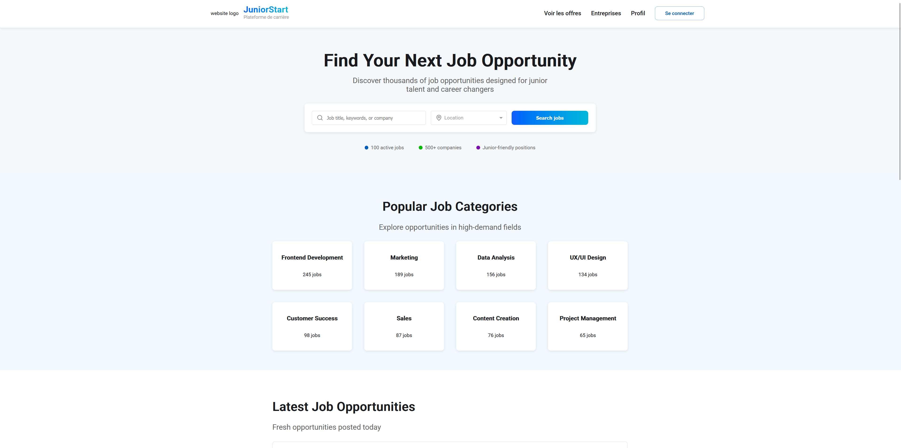
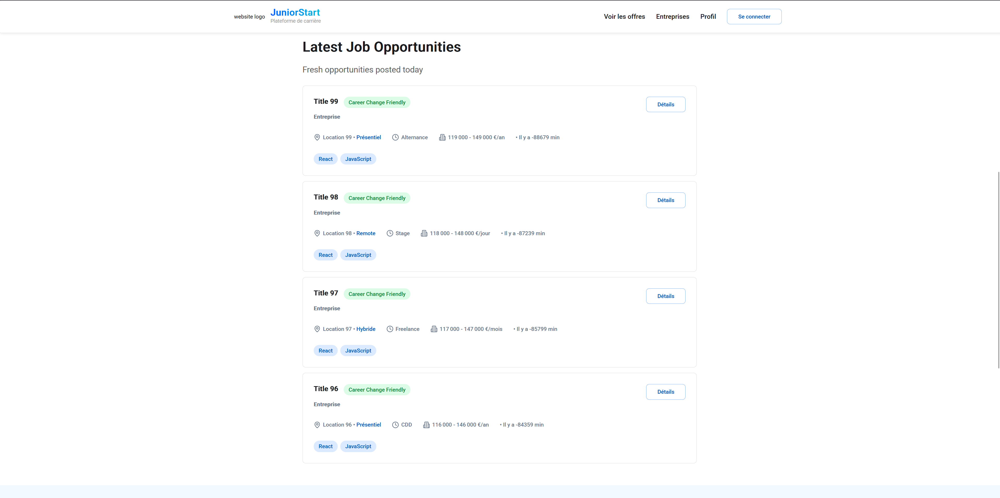
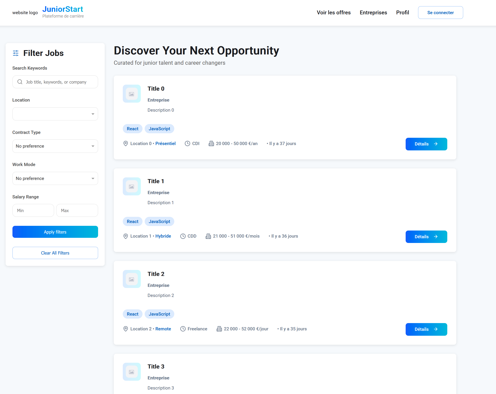
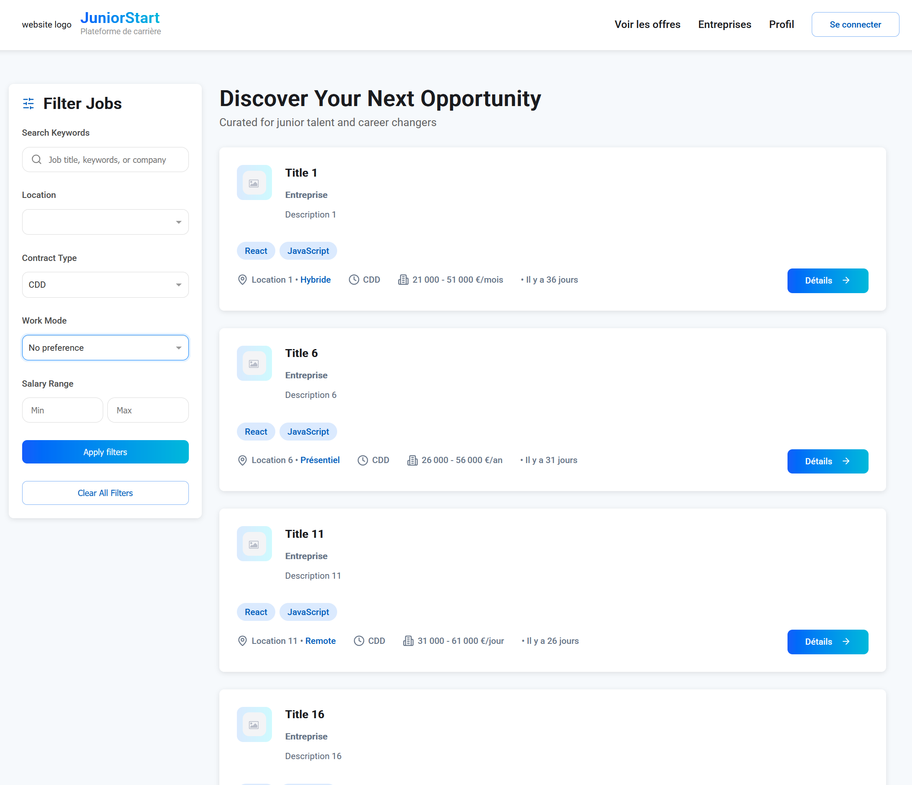

# JuniorOnly

Project Overview

A job platform designed specifically for entry-level candidates and career changers looking for their first permanent (CDI) or fixed-term (CDD) positions.
It helps users filter out misleading "junior" offers and makes the job search easier and more relevant, with search options by sector, location, and contract type.

    This project is unfinished.

Tech Stack
Backend

    ASP.NET Core 8

    Entity Framework Core for data access

    Identity / JWT Bearer for authentication

    FluentValidation for input validation

    Clean architecture approach

Frontend

    Angular 17+

    Angular Material for UI components

    RxJS for managing data streams and reactive programming

Current Progress

    Basic services and repositories

    Initial unit tests

    Base CRUD controllers for every entity

    Preparing user authentication (login/signup)

    Ongoing work on expanding unit tests and authentication controller

    Build the initial Angular frontend

    Add advanced filtering and search features

Next Steps

    Implement authentication endpoints

    Extend test coverage

    Improve error handling and validation

# Screenshots
Some visual of the project **this is not a finished and polished project** 

